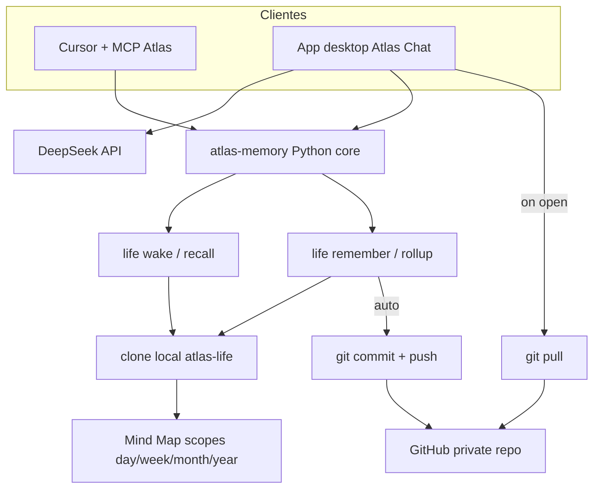

# Atlas Life Memory (Cursor + Desktop DeepSeek + GitHub privado)

## Decisões travadas

- **Escopo:** qualquer conversa (vida + coding), não só decisões de repo.
- **Persistência:** repo GitHub **privado** = fonte da verdade (markdown + índices git-versionados).
- **Grafo:** Mind Map (não Graphify) no life root; índice temporal em `graphify-index.md`.
- **Interfaces:**
  1. **Cursor** — agente + MCP/skill Atlas (coding + life quando aberto no life root).
  2. **App desktop** — chat dedicado com **API DeepSeek**; sempre sincroniza memórias com o GitHub privado; **commit+push automático** de drawers novos.
- **LLM do desktop:** DeepSeek (OpenAI-compatible chat completions). Chave só em config local / env (`DEEPSEEK_API_KEY`) ou keychain do OS — **nunca** no repo `atlas-life`, no código do `atlas-memory`, nem no plano/docs. Se a chave foi colada em chat, **rodar** e usar uma nova.

## Arquitetura



**Dois modos no mesmo protocolo Atlas:**

| Modo | Root | GraphBackend | Rooms | Clientes |
|------|------|--------------|-------|----------|
| Project (atual) | repo do código | Graphify *ou* Mind Map | architecture, debugging, … | Cursor |
| Life (novo) | `~/atlas-life` (clone do GitHub privado) | **só Mind Map** | day, week, month, year, people, general | Cursor + **Desktop** |

## App desktop (Atlas Chat)

### Stack (escolha concreta)

- **Tauri 2 + React** (leve, nativo Windows) no diretório `apps/atlas-chat/`.
- Backend local: chama o **mesmo core Python** (`atlas-memory` instalado) via sidecar/`atlas` CLI — sem duplicar schema/git.
- Chat: HTTP para `https://api.deepseek.com` (modelo default `deepseek-chat`; configurável).

### Fluxo de sessão

1. **Abrir app** → `git pull --rebase` no `ATLAS_LIFE_ROOT` (falha de rede = banner; continua com clone local).
2. **Wake** → `atlas life wake` → injeta no system prompt só o hot set do dia (+ week summary se existir).
3. **Usuário conversa** → mensagens vão para DeepSeek com tools/protocolo Atlas no system prompt.
4. **Após cada resposta** (ou fim de turno com fatos duráveis) → extrair 0..N drawers → `atlas life remember` (valida + secrets scan).
5. **Auto-commit** se houver arquivos novos/alterados:
   - `git add` drawers + índices tocados
   - `git commit -m "life: remember YYYY-MM-DD …"`
   - `git push` origin
6. **Fechar / timer diário** → `atlas life rollup day` (se houver ≥N drawers no dia) + push.

### UI (mínima)

- Uma composição de chat (não dashboard): histórico do dia, input, status sync (pulled / committing / pushed / offline).
- Settings: path do clone, remote `OWNER/atlas-life`, `DEEPSEEK_API_KEY`, modelo, toggle auto-push (default **on**).
- Sem cards no hero; sem visualizador Mind Map na v1 (só status “mindmap scope stale/ready”).

### Auth GitHub

- Preferir `gh auth` / credential helper já no sistema; fallback: token `GITHUB_TOKEN` só local (gitignore / OS keychain).
- `life init` exige repo **private** (`gh repo view --json isPrivate`).

## Layout do repo privado (`atlas-life`)

```text
atlas-life/
  .cursor/
    mempalace-index.md
    graphify-index.md       # scopes Mind Map temporais
    project-cache.md
    rules/atlas.mdc
    skills/atlas/
    atlas-drawers/
      day/2026-07-29/*.drawer.md
      week/2026-W31/*.drawer.md
      month/2026-07/*.drawer.md
      year/2026/*.drawer.md
      people/*.drawer.md
      general/*.drawer.md
  mindmaps/
  README.md
  .gitignore
```

Hierarquia: **Day** (quente) → **Week** → **Month** → **Year** (rollups).

## Extensões de schema (este repo)

Arquivos: [`src/atlas_memory/drawer.py`](src/atlas_memory/drawer.py), [`schemas/drawer.schema.json`](schemas/drawer.schema.json), MCP/CLI/init, skill/rule.

- **Types life:** `memory` | `event` | `person` | `goal` (+ `preference` | `lesson` | `decision`).
- **Rooms life:** `day` | `week` | `month` | `year` | `people` | `general`.
- Campos: `when:`, `period:`, `topics:`; git fields `-` se N/A.
- Secrets: mesmo scanner; chave DeepSeek **nunca** em drawer.

## CLI / MCP

```bash
atlas life init [--repo OWNER/atlas-life] [--private-check]
atlas life wake
atlas life remember --text "…" [--push]   # desktop usa --push sempre
atlas life rollup day|week|month|year [--push]
atlas life pull | push | sync             # sync = pull then push if ahead
```

MCP (Cursor): `atlas_life_wake` | `remember` | `recall` | `rollup` (+ tools project existentes).

Core git helpers em algo como `src/atlas_memory/life_git.py` (pull/rebase, commit message padrão, push, detect dirty).

## Protocolo (Cursor e Desktop)

1. Life root via `ATLAS_LIFE_ROOT`.
2. Wake = dia atual + hot set (sem dump anual).
3. Responder com memória real; não inventar.
4. Fatos duráveis → drawer tipado no `day/YYYY-MM-DD`.
5. Atualizar Mind Map do scope do dia; index `ready`/`stale`.
6. Desktop: commit+push automático; Cursor skill: push após checkpoint life (ou `--push`).
7. Rollup week/month/year sob demanda ou no fechamento.

## DeepSeek — contrato do system prompt

- Instruções Atlas life (ordem wake → answer → remember).
- Bloco `## Wake` com drawers hot (texto curto).
- Pedir JSON estruturado opcional no fim do turno para memórias novas, ex.:

```json
{"memories":[{"type":"memory","summary":"…","why":"…","topics":["…"]}]}
```

Desktop parseia → `atlas life remember` por item → auto git sync. Se JSON ausente/inválido, não grava (não alucinar drawer).

## Bootstrap

1. `gh repo create atlas-life --private` (ou remoto já existente).
2. `atlas life init --repo USER/atlas-life`.
3. Cursor: MCP + skill; Desktop: instalar app, colar `DEEPSEEK_API_KEY`, apontar clone.
4. Abrir desktop → pull → wake → chat → remember → commit/push automático.

## Segurança

- Repo private obrigatório no init.
- `.gitignore`: `.env*`, keys, DB MemPalace local.
- DeepSeek key só em OS keychain / env local do app.
- Checkpoint rejeita padrões de secret antes do commit.
- Sem force-push; conflito de pull → UI pede resolução (stash/rebase abort + aviso).

## Ordem de implementação

1. Schema + `drawer.py` + testes.
2. CLI `atlas life *` + `life_git` (pull/commit/push) + verificação private.
3. MCP life tools.
4. Skill/rule/templates + `docs/life.md` + `docs/atlas-chat.md`.
5. App `apps/atlas-chat` (Tauri): settings, chat DeepSeek, wake inject, remember parse, auto sync.
6. Eval cases wake/remember/sync.

## Fora de escopo (agora)

- Visualizador gráfico Mind Map no desktop.
- Import automático de transcripts antigos do Cursor.
- Multi-user / sync em tempo real além de git.
- Outros providers LLM no desktop (DeepSeek only na v1; interface pode abstrair depois).
